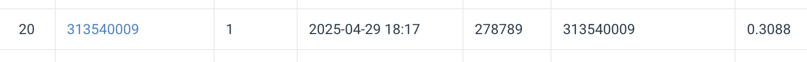

# NYCU Visual Recognition Using Deep Learning 2025 Spring HW3

StudentID: 313540009
Name: Anna Kompan (安娜)

## Introduction

Task: Instance Segmentation of colored medical images

- Segmentation masks include 4 classes for 4 types of cells
- Dataset includes train and test images + masks in '.tif format
- 'data_loader.py' for pre-processing images and class-specific masks
- 'utils.py' for encoding masks and showing segmentation results
- 'codes.ipynb' for training model, plotting training results
- To lint code 'nbqa' and 'flake8' used

## How to install

Need to install dependencies:

```
pip install torch torchvision
pip install pandas
pip install Pillow
pip install pycocotools
pip install numpy
pip install tifffile
pip isntall notebook
pip install nbqa flake8
```

Recommend using Conda for version cotrol
Python version used is 3.11.11

## Performance snapshot


