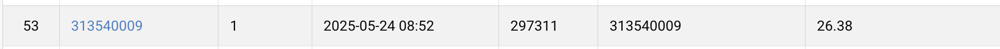

# NYCU Visual Recognition Using Deep Learning 2025 Spring HW4

StudentID: 313540009
Name: Anna Kompan (安娜)

## Introduction

Task: Image Restoration

- Dataset includes 1600 degraded images of 2 types(Rain and Snow)
- Test includes 50 degraded images per type
- 'data_loader.py' for pre-processing training images
- 'test_data_loader.py' for pre-processing images in test folder
- 'code.ipynb' for training model, plotting training results
- To lint code 'nbqa' and 'flake8' used
- PSNR (Peak Signal-to-Noise Ratio) used for evaluation

## How to install

```
pip install torch torchvision
pip install matplotlib
pip install numpy
pip install tqdm
pip install scikit-learn
pip isntall notebook
pip install nbqa flake8
```

Recommend using Conda for version cotrol
Python version used is 3.11.11

## Performance snapshot


